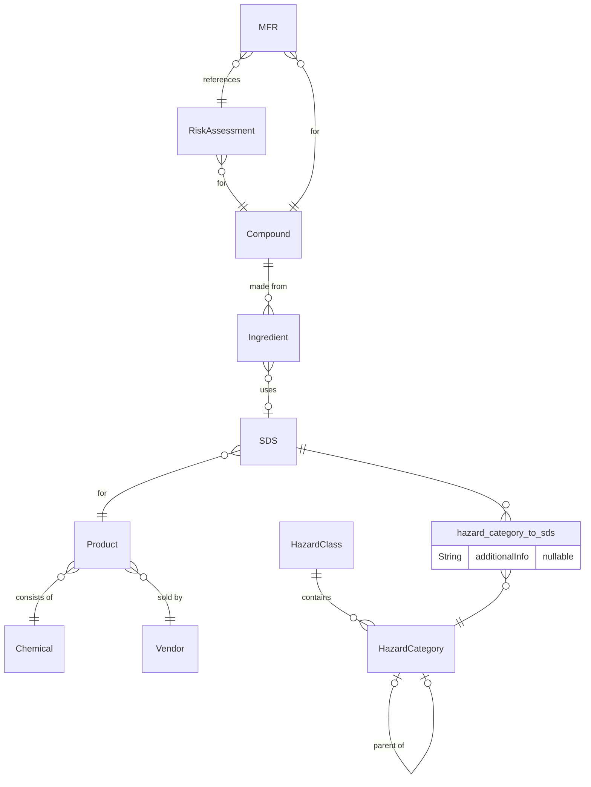
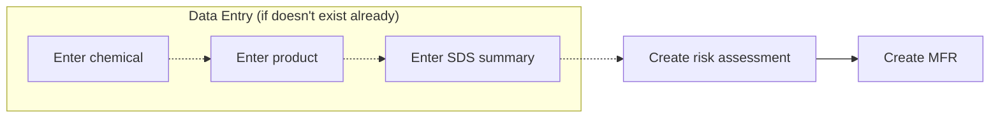

# Compounding Helper

Compounding Helper is a web app in development meant to assist with the creation and maintenance of risk assessments for non-sterile compounding in Canadian pharmacies.

## Diagrams

### ER diagram

### Workflow

## Referenced documents

 - [NAPRA - Guidance Document for Pharmacy Compounding of Non-sterile Preparations](https://www.napra.ca/general-practice-resources/guidance-document-pharmacy-compounding-non-sterile-preparations)
 - [NIOSH List of Antineoplastic and Other Hazardous Drugs in Healthcare Settings](https://www.cdc.gov/niosh/docs/2016-161/default.html)
 - [Globally Harmonized System of Classification and Labelling of Chemicals (GHS Rev. 9, 2021)](https://unece.org/transport/standards/transport/dangerous-goods/ghs-rev9-2021)
